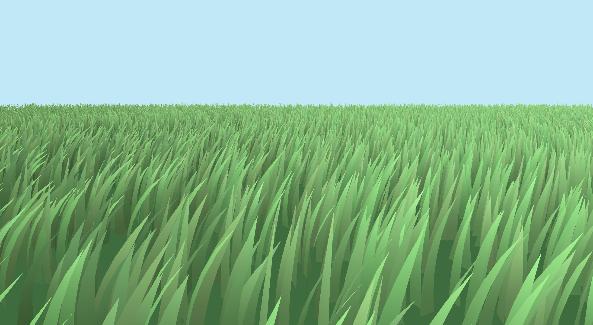
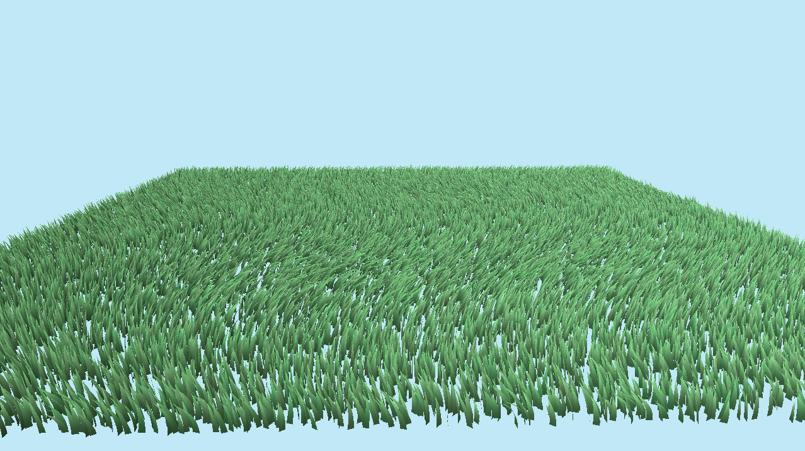

# wgpu-procedural-grass

This project simulates a field of grass using instanced rendering with the `wgpu` graphics API. Inspired by [Advanced Graphics Summit Procedural Grass](https://gdcvault.com/play/1027033/Advanced-Graphics-Summit-Procedural-Grass)

## Features

- Instanced rendering of grass meshes
- Multi-segment grass blades
- Wind simulation using compute shaders
- Customizable grass properties

## Project Structure

- `src/main.rs`: Entry point of the application, initializes the wgpu instance and rendering loop.
- `src/renderer/`: Contains modules for rendering.
- `src/shaders/`: WGSL shaders for rendering grass and simulating wind effects.
- `src/grass/`: Manages grass instances and their properties.
- `src/camera/`: Handles camera.

## Future Enhancements

- Interactive grass (player collision)
- Multiple grass types (tall/short, stiff/flexible)
- LOD system for large fields
- Texture mapping
- Grass clumping/clustering
